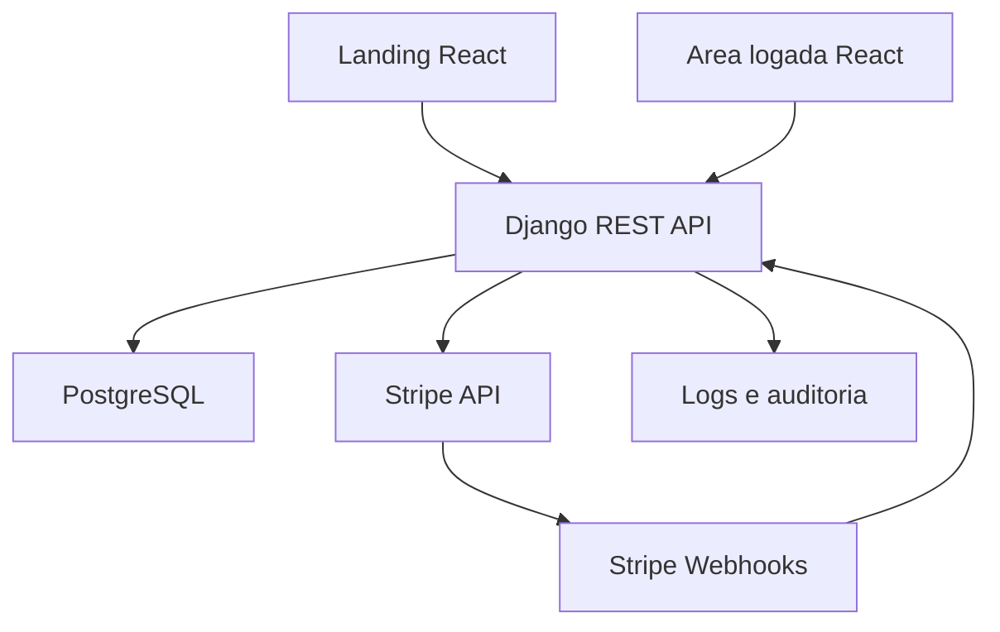

# Arquitetura - SmartControl Sites

## Identidade

**Nome:** SmartControl Sites

**Posicionamento:** plataforma SaaS moderna para criacao, venda, assinatura e gestao de sites profissionais.

**Paleta**

- Azul tecnologico: `#2563EB`
- Ciano de confianca: `#06B6D4`
- Verde de sucesso: `#22C55E`
- Grafite: `#111827`
- Cinza de interface: `#F3F4F6`
- Branco: `#FFFFFF`

**Tipografia**

- Principal: Inter
- Alternativa: Manrope

## Visao geral

## Backend

O backend segue uma divisao por dominios:

- `users`: autenticacao, usuarios, roles e logs de auth.
- `clients`: dados comerciais dos clientes.
- `projects`: projetos, sites e solicitacoes.
- `billing`: planos, assinaturas, pagamentos, checkout e webhooks Stripe.
- `core`: permissoes, middlewares, validadores, auditoria e configuracoes transversais.

Cada app usa:

- `models.py`: entidades persistentes.
- `serializers.py`: validacao e transformacao de payloads.
- `views.py`: controllers REST.
- `services.py`: regras de negocio.
- `urls.py`: rotas do dominio.

## Frontend

O frontend foi organizado para crescer sem virar um bloco unico:

- `pages`: telas publicas, autenticadas e admin.
- `components`: componentes reutilizaveis.
- `services`: cliente HTTP e modulos de API.
- `hooks`: estado e regras reutilizaveis.
- `contexts`: sessao/autenticacao.
- `routes`: rotas publicas, privadas e protegidas por role.
- `utils`: validacao, formatacao e seguranca.

## Autenticacao

- Access token JWT curto: 15 minutos.
- Refresh token: 7 dias, com rotacao e blacklist.
- Senha com Argon2.
- Login sem revelar se o usuario existe.
- Recuperacao de senha com resposta generica.
- Rate limiting por escopo.

## Autorizacao

Roles:

- `admin`: acesso total.
- `client`: acesso apenas aos proprios dados.

Regras centrais:

- Cliente so visualiza seus projetos, pagamentos, assinaturas e solicitacoes.
- Admin gerencia clientes, planos, projetos, pagamentos e solicitacoes.
- Operacoes sensiveis geram auditoria.

## Pagamentos

Stripe cobre:

- Pagamento unico do projeto.
- Assinatura mensal.
- Webhooks assinados para sincronizacao.

Eventos tratados:

- `checkout.session.completed`
- `invoice.payment_succeeded`
- `invoice.payment_failed`
- `customer.subscription.created`
- `customer.subscription.updated`
- `customer.subscription.deleted`

Pagamento falho altera a assinatura para status irregular, bloqueando servicos dependentes de assinatura ativa.

## Seguranca

Implementacoes planejadas desde a base:

- CORS restrito por ambiente.
- CSRF trusted origins configuraveis.
- CSP via `django-csp`.
- HSTS em producao.
- `X-Frame-Options: DENY`.
- `X-Content-Type-Options: nosniff`.
- Sanitizacao textual com `bleach`.
- ORM Django contra SQL injection.
- Rate limit de auth e API.
- Logs estruturados.
- Secrets em `.env`.

## Fluxo de cliente

1. Visitante chega na landing.
2. Escolhe plano ou solicita contato.
3. Cria conta ou e cadastrado pelo admin.
4. Realiza pagamento unico e/ou assinatura.
5. Acompanha projeto e solicita alteracoes pelo dashboard.
6. Status financeiro e acesso sao sincronizados por webhook.

## Fluxo administrativo

1. Admin cria/edita planos.
2. Admin gerencia clientes.
3. Admin cria projetos e acompanha status.
4. Admin acompanha pagamentos e assinaturas.
5. Admin responde solicitacoes.
6. Acoes sensiveis ficam registradas.
